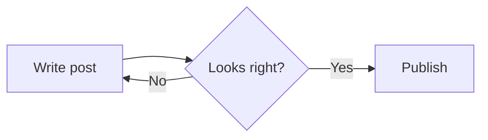

import Callout from "../../../components/Callout.astro";
import Figure from "../../../components/Figure.astro";
import devNotesImage from "../../../assets/category-defaults/dev-notes.png";

## Headings

### Heading level 3

#### Heading level 4

## Text styles

Plain paragraph text with **bold**, *italic*, ***bold italic***, ~~strikethrough~~,
and `inline code`. Here's a [link to Astro](https://astro.build).

## Blockquote

> A blockquote can span multiple lines.
>
> Second paragraph inside the same quote.

## Lists

Unordered:

- First item
- Second item
  - Nested item
  - Another nested item
- Third item

Ordered:

1. First step
2. Second step
   1. Nested step
3. Third step

Task list:

- [x] Done task
- [ ] Not done task

## Table

| Name    | Type    | Default |
| ------- | ------- | ------- |
| `title` | string  | —       |
| `draft` | boolean | `false` |
| `tags`  | array   | `[]`    |

## Code

Inline: `const x = 1`.

```js
function greet(name) {
  return `Hello, ${name}!`;
}

console.log(greet("world"));
```

With a filename header (add `title="..."` after the language):

```ts title="src/utils/sheets.ts"
export async function menambahBarisBaru(spreadsheetId: string) {
  return spreadsheetId;
}
```

## Callouts

<Callout type="info">This is an info callout. Default type if you omit `type`.</Callout>

<Callout type="success">This is a success callout.</Callout>

<Callout type="warning">This is a warning callout.</Callout>

<Callout type="danger">This is a danger callout.</Callout>

## Details

<details>
  <summary>Click to expand</summary>

  Hidden content shown after expanding. Works via raw HTML `<details>`/`<summary>`.
</details>

## Image


## Image with caption

<Figure
  src={devNotesImage}
  alt="Dev Notes category default cover"
  caption="Default cover image used for posts in the Dev Notes category."
/>

## Horizontal rule

---

## Diagram (Mermaid)



## Embed

<iframe
  width="100%"
  height="315"
  src="https://www.youtube-nocookie.com/embed/dQw4w9WgXcQ"
  title="YouTube video embed"
  frameborder="0"
  allowfullscreen
></iframe>
