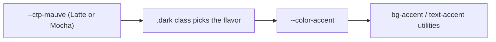

Every Catppuccin color is a CSS variable, redefined once under a `.dark` class. Tailwind's
`@theme` block then points each utility color at that variable, so `bg-base`, `text-mauve`,
and friends just work in both modes with zero `dark:` prefixes needed for color alone.



The accent color is aliased separately:

```css
--color-accent: var(--ctp-mauve);
```

Change that one line, and every link, button, and active nav state follows.
